## 🌸 깨끗한 꽃놀이 (Clean Cherry Blossom)

## Screen configuration 📺

| Main                                              |
| ------------------------------------------------- |
| 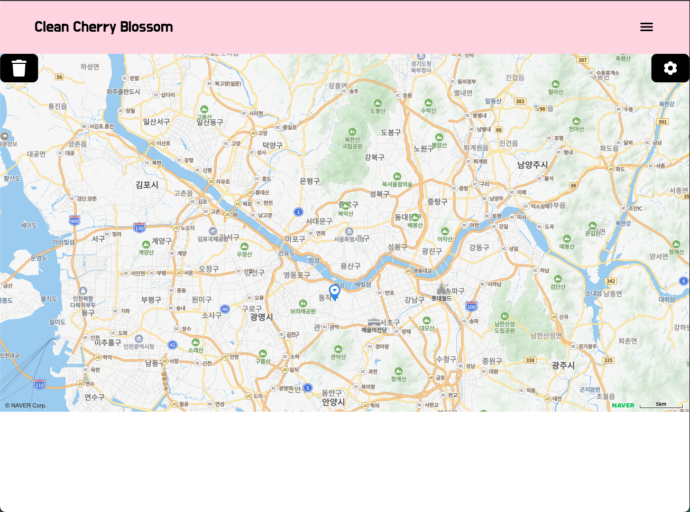 |
| 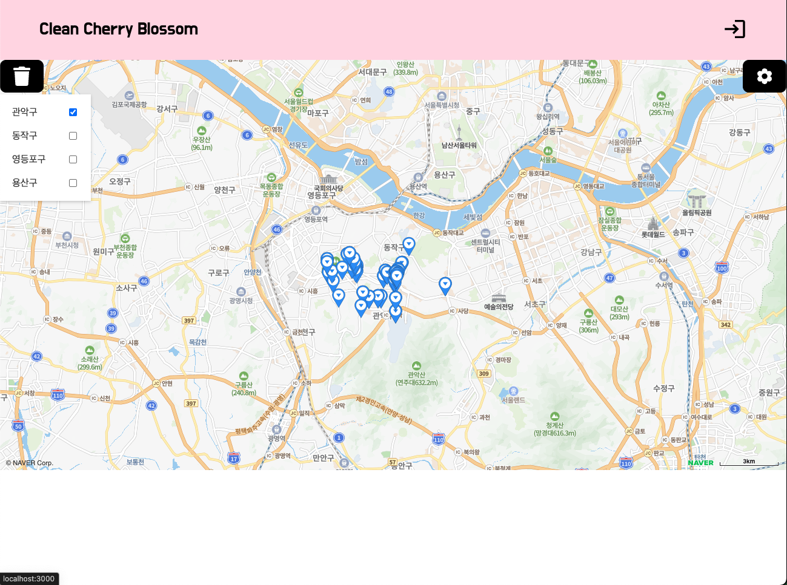 |
| 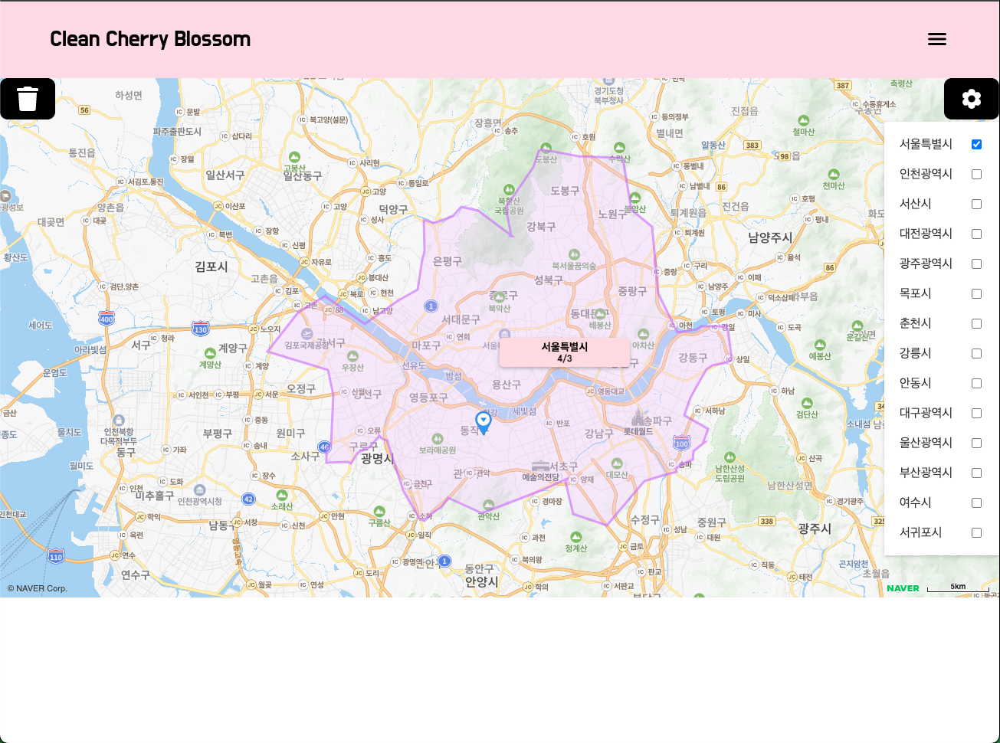 |

| Login                                             |
| ------------------------------------------------- |
| 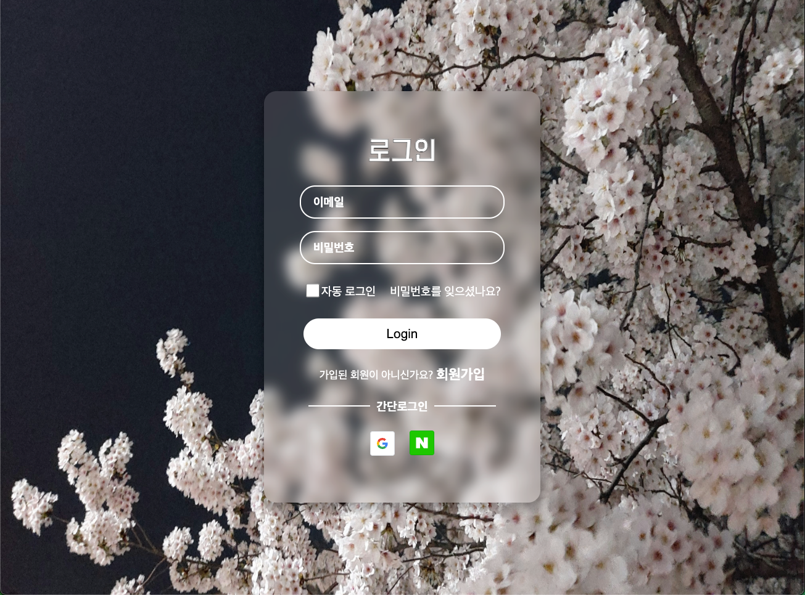 |

| Register                                              |
| ----------------------------------------------------- |
| 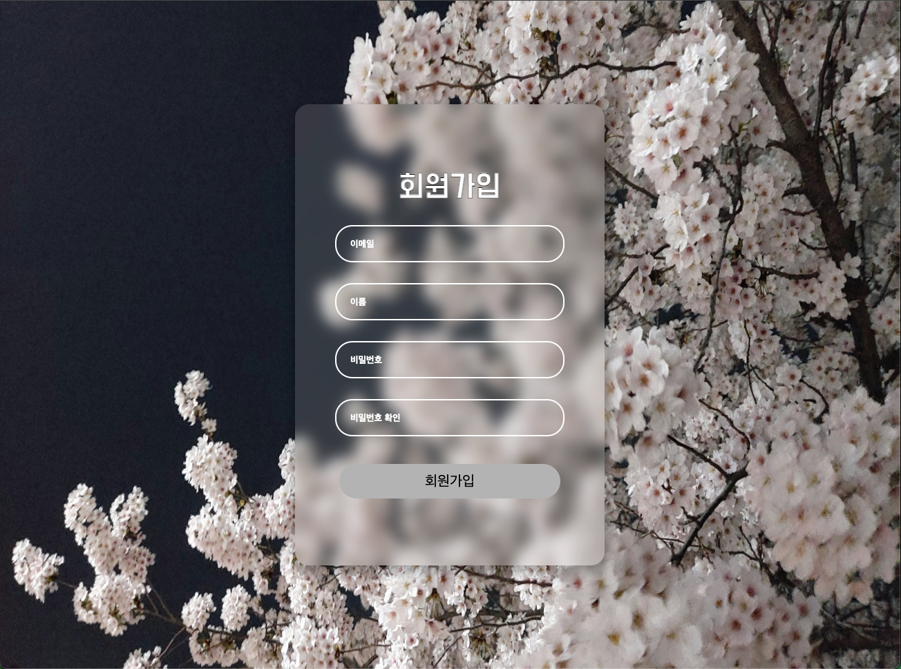 |
| 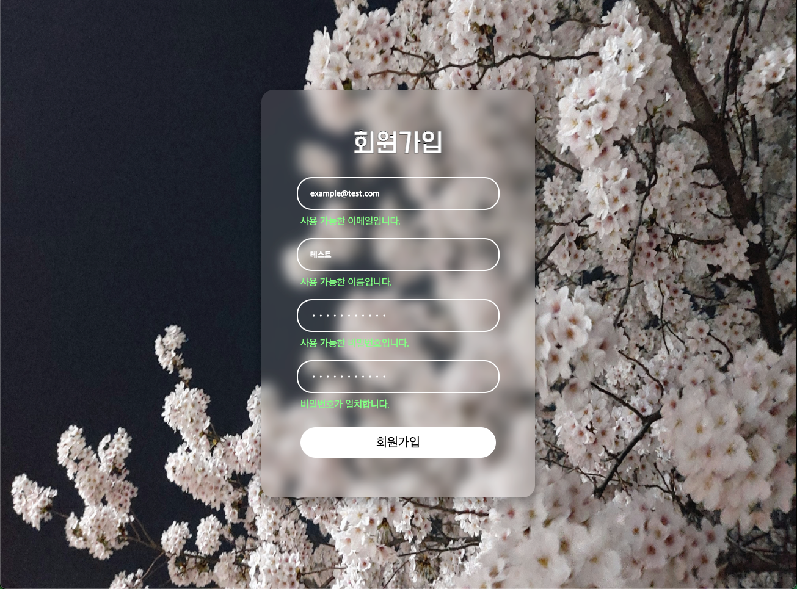 |

| User Info                                             |
| ----------------------------------------------------- |
| 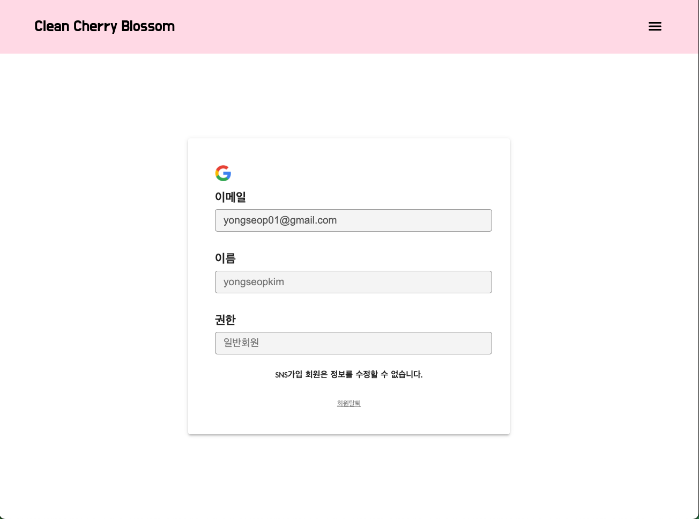 |
| 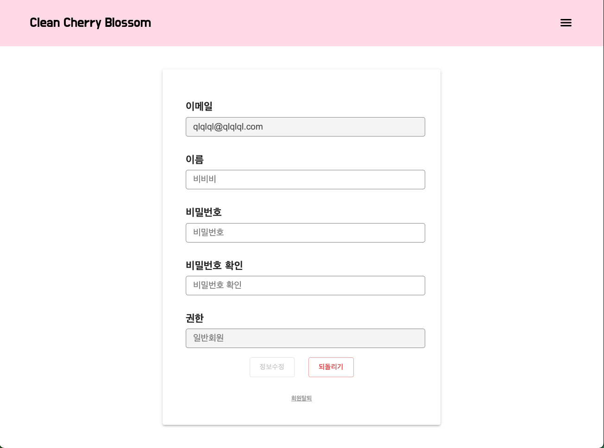 |
| 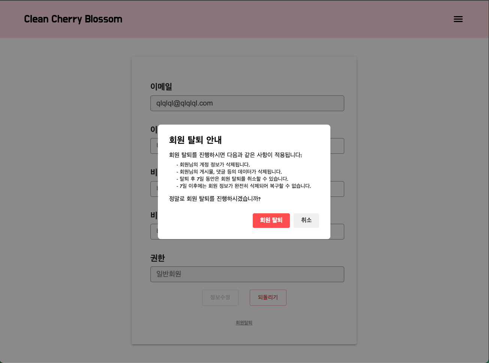 |

| Report List                                        |
| -------------------------------------------------- |
| 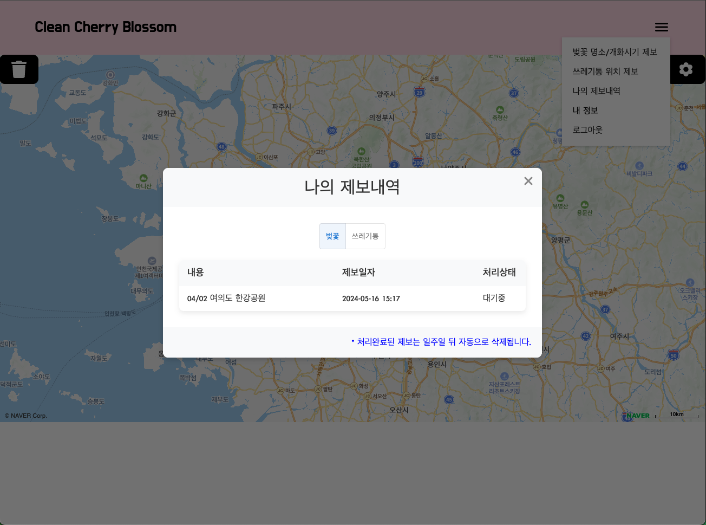 |

| Report Modal                                        |
| --------------------------------------------------- |
| 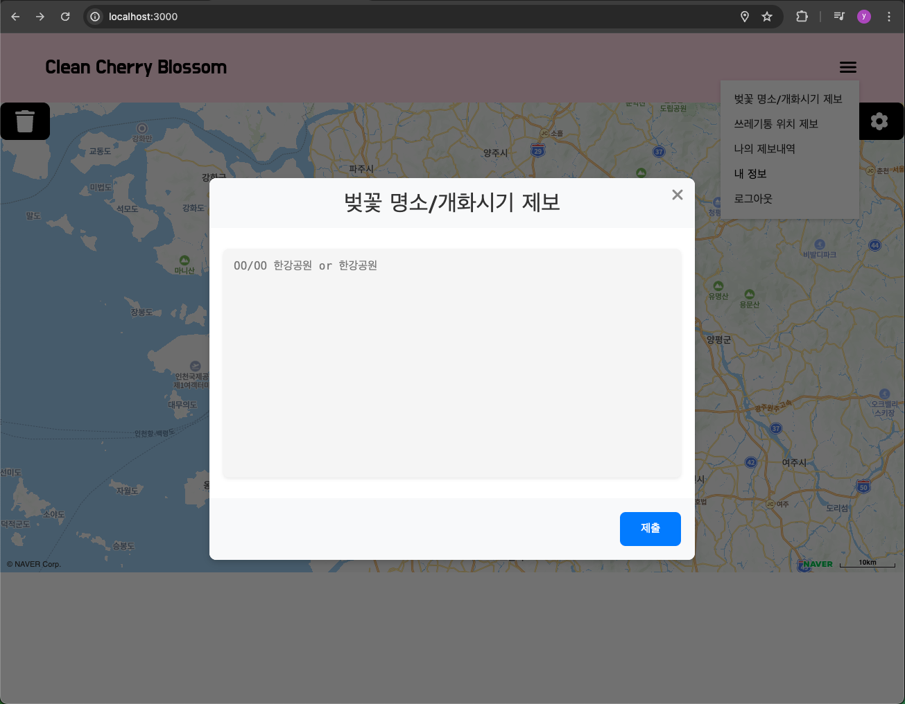 |
| 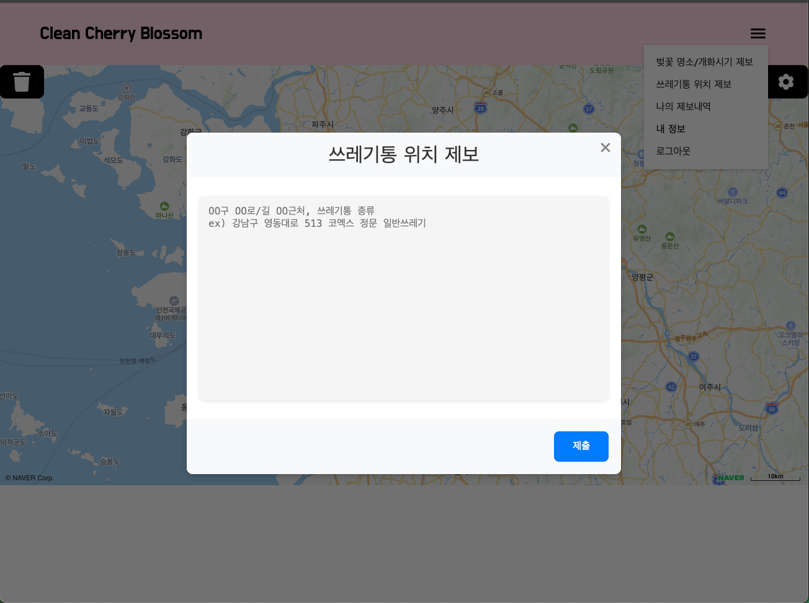 |

| Admin Page                                              |
| ------------------------------------------------------- |
| 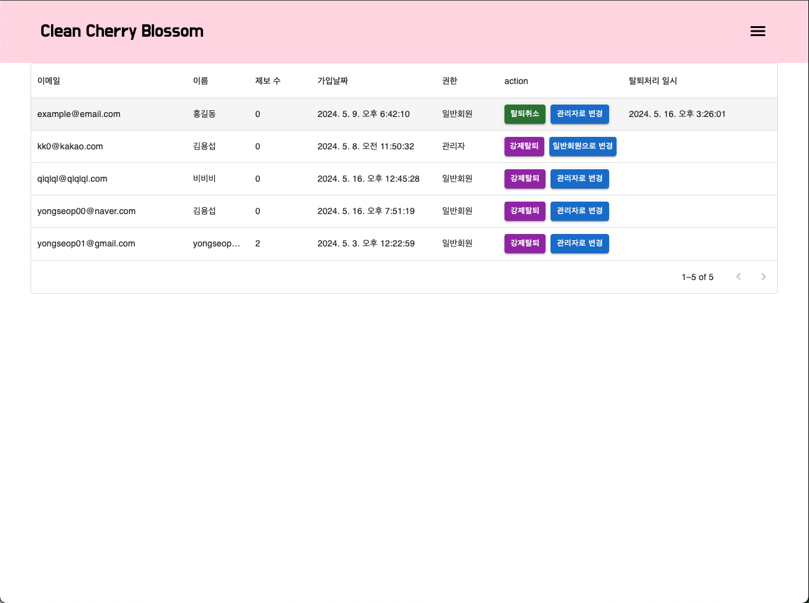 |
| 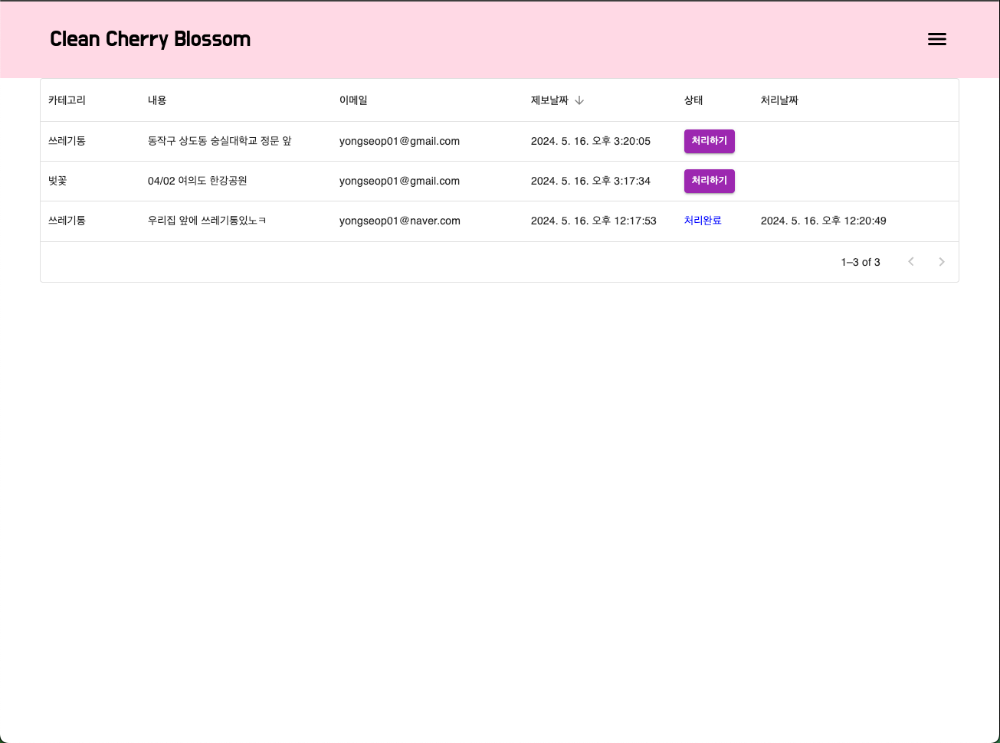 |

## Project Structure 🌲

```
cherry-blossom-clean-react
├─ .eslintrc.cjs
├─ .gitignore
├─ README.md
├─ index.html
├─ package-lock.json
├─ package.json
├─ public
│  ├─ fonts
│  │  └─ DoHyeon-Regular.ttf
│  ├─ images
│  │  ├─ googleLogin.png
│  │  ├─ kakaoLogin.png
│  │  ├─ memberBackground.jpg
│  │  ├─ mobile-member-background.jpeg
│  │  ├─ naverlogo.png
│  │  └─ trash-icon.png
│  └─ vite.svg
├─ src
│  ├─ App.css
│  ├─ App.jsx
│  ├─ assets
│  │  ├─ boundary
│  │  │  ├─ andongBoundary.json
│  │  │  ├─ busanBoundary.json
│  │  │  ├─ chuncheonBoundary.json
│  │  │  ├─ daeguBoundary.json
│  │  │  ├─ daejeonBoundary.json
│  │  │  ├─ gangneungBoundary.json
│  │  │  ├─ gwangjuBoundary.json
│  │  │  ├─ incheonBoundary.json
│  │  │  ├─ mokpoBoundary.json
│  │  │  ├─ seogwipoBoundary.json
│  │  │  ├─ seosanBoundary.json
│  │  │  ├─ seoulBoundary.json
│  │  │  ├─ ulsanBoundary.json
│  │  │  └─ yeosuBoundary.json
│  │  └─ react.svg
│  ├─ components
│  │  ├─ blossom-map
│  │  │  ├─ jsx
│  │  │  │  ├─ AdminMemberManagement.jsx
│  │  │  │  ├─ AdminReportList.jsx
│  │  │  │  ├─ CustomOverlay.jsx
│  │  │  │  └─ MapTemplate.jsx
│  │  │  └─ scss
│  │  │     ├─ AdminMemberManagement.scss
│  │  │     ├─ AdminReportList.scss
│  │  │     └─ MapTemplate.scss
│  │  ├─ layout
│  │  │  ├─ jsx
│  │  │  │  ├─ Dropdown.jsx
│  │  │  │  ├─ ErrorPage.jsx
│  │  │  │  ├─ Header.jsx
│  │  │  │  ├─ Modal.jsx
│  │  │  │  ├─ MyInfo.jsx
│  │  │  │  └─ Skeleton.jsx
│  │  │  └─ scss
│  │  │     ├─ Dropdown.scss
│  │  │     ├─ ErrorPage.scss
│  │  │     ├─ Header.scss
│  │  │     ├─ Modal.scss
│  │  │     ├─ MyInfo.scss
│  │  │     └─ WithdrawalModal.scss
│  │  └─ member
│  │     ├─ jsx
│  │     │  ├─ ForgetPassword.jsx
│  │     │  ├─ GoogleLoginComponent.jsx
│  │     │  ├─ Login.jsx
│  │     │  ├─ NaverLogin.jsx
│  │     │  ├─ NaverLoginComponent.jsx
│  │     │  └─ Resister.jsx
│  │     └─ scss
│  │        ├─ Login.scss
│  │        └─ Register.scss
│  ├─ config
│  ├─ index.css
│  ├─ main.jsx
│  └─ util
│     └─ login-util.jsx
└─ vite.config.js
```
